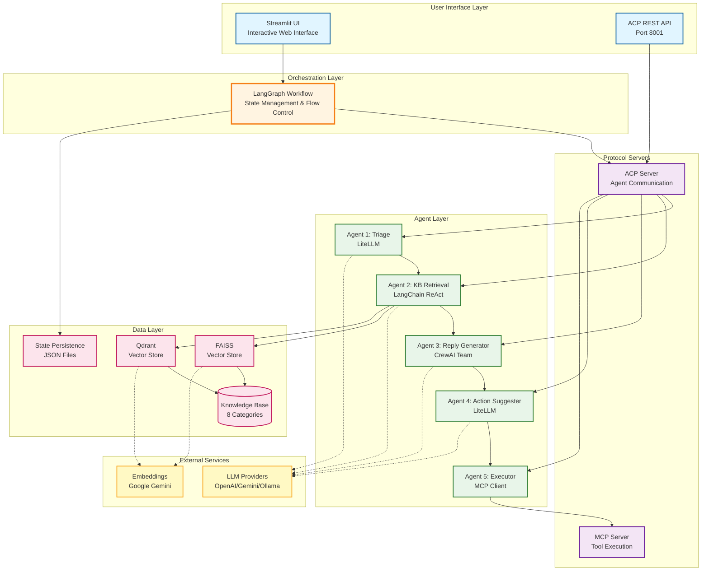
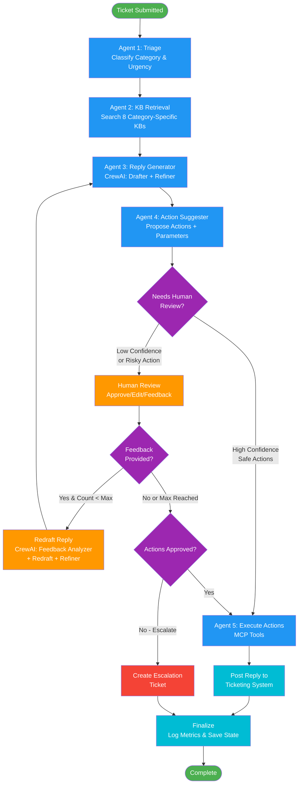

# 🎫 Customer Support Triage & Action Automation System

> **An advanced multi-agent AI system for automated customer support ticket handling from classification to knowledge retrieval, reply drafting, action suggestion, and execution with human-in-the-loop oversight.**

[](https://www.python.org/downloads/)
[](https://github.com/langchain-ai/langgraph)
[](https://www.crewai.com/)
[](LICENSE)

---

## 📑 Table of Contents

- [Overview](#-overview)
- [Problem and The Solution](#-problem-and-the-solution)
- [System Architecture](#-system-architecture)
  - [System Overview (Diagram)](#system-overview)
  - [Five Core Agents](#five-core-agents)
  - [Workflow Orchestration (Diagram)](#workflow-orchestration)
  - [Communication Protocols](#communication-protocols)
- [Key Features](#-key-features)
- [Tech Stack](#-tech-stack)
- [Repository Structure](#-repository-structure)
- [Setup and Installation](#-setup-and-installation)
- [Usage](#-usage)
- [Example Workflow](#-example-workflow)
- [Configuration](#-configuration)
- [License](#-license)
- [Author](#-author)

---

## 🌟 Overview

The **Customer Support Triage & Action Automation System** is a production-grade, modular AI platform that automates end-to-end customer support workflows. Built with modern frameworks like **LangGraph**, **CrewAI**, and **LangChain**, it combines multi-agent orchestration with protocol-based interoperability (**ACP** and **MCP**) to deliver intelligent, scalable, and human-supervised automation.

This system demonstrates:
- **Advanced AI Engineering**: Multi-agent coordination, LLM orchestration, and retrieval-augmented generation (RAG)
- **Clean Architecture**: Modular design with separation of concerns, extensible agent framework
- **Production Readiness**: Human-in-the-loop workflows, error handling, state persistence, and comprehensive logging
- **Protocol Interoperability**: ACP (Agent Communication Protocol) and MCP (Model Context Protocol) for cross-framework communication

---

## 🚨 Problem and The Solution

Customer support teams face overwhelming volumes of tickets daily, leading to slow response times, manual triage, repetitive work, inconsistent quality, and high operational costs. 

This system provides **end-to-end automation** of customer support workflows:

1. **Intelligent Triage**: Automatically classifies tickets into 8 categories (billing, technical, account, product, feedback, orders, compliance, general) and assigns urgency levels (low, medium, high, critical)

2. **Knowledge Retrieval**: Searches across multiple specialized knowledge bases using vector similarity (FAISS/Qdrant) to retrieve relevant context

3. **Reply Drafting**: Generates professional, context-aware customer responses using a multi-agent CrewAI team (drafter + refiner)

4. **Action Suggestions**: Recommends system actions (refunds, password resets, escalations, etc.) based on ticket analysis

5. **Human-in-the-Loop**: Pauses for human review when confidence is low, actions are risky, or feedback is needed; supports **redrafting cycles** with AI assistance

6. **Action Execution**: Safely executes approved actions through MCP tools (simulated in MVP, production-ready architecture)

---

## 🏗️ System Architecture

### System Overview



---

### Five Core Agents

#### 1. **Triage Agent** (Agent 1)
- **Framework**: LiteLLM + Custom Prompts
- **Input**: Raw ticket text
- **Output**: Category (1 of 8) + Urgency (1 of 4) + Confidence scores
- **Method**: Zero-shot LLM classification with structured XML output parsing
- **Models**: Configurable (default: `ollama/qwen2.5:7b` or `gemini/gemini-2.5-flash`)

#### 2. **Knowledge Base Agent** (Agent 2)
- **Framework**: LangChain ReAct Agent + Multiple Retrievers
- **Input**: Ticket text + Category
- **Output**: Retrieved KB articles + Consolidated summary (XML format)
- **Method**: 
  - 8 category-specific vector retrievers (FAISS or Qdrant)
  - Adaptive retrieval strategies (MMR for diverse results)
  - Agent intelligently selects relevant retrievers to query
- **Models**: `gemini/gemini-2.5-flash` (configurable)

#### 3. **Reply Generator Agent** (Agent 3)
- **Framework**: CrewAI Multi-Agent Team
- **Input**: Ticket + KB Context + (Optional) Human Feedback
- **Output**: Customer-facing reply draft
- **Method**: 
  - **Initial Draft**: Drafter → Refiner (2-agent sequential workflow)
  - **Redraft Mode**: Feedback Analyzer → Redraft Agent → Refiner (3-agent workflow)
  - Supports up to N redraft iterations (configurable, default: 2)
- **Models**: `ollama/qwen2.5:7b` (configurable)

**CrewAI Team Structure**:

```mermaid
flowchart TB
    subgraph INITIAL["Initial Draft Mode"]
        I1[Ticket + KB Context] --> D1[Drafter Agent]
        D1 --> R1[Refiner Agent]
        R1 --> O1[Final Draft]
    end
    
    subgraph REDRAFT["Redraft Mode"]
        I2[Previous Draft +<br/>Human Feedback] --> A2[Feedback Analyzer]
        A2 --> D2[Redraft Agent]
        D2 --> R2[Refiner Agent]
        R2 --> O2[Improved Draft]
    end
    
    style I1 fill:#e3f2fd,stroke:#1976d2,stroke-width:2px
    style I2 fill:#fff3e0,stroke:#f57c00,stroke-width:2px
    style D1 fill:#c8e6c9,stroke:#388e3c,stroke-width:2px
    style D2 fill:#c8e6c9,stroke:#388e3c,stroke-width:2px
    style A2 fill:#fff9c4,stroke:#f9a825,stroke-width:2px
    style R1 fill:#f8bbd0,stroke:#c2185b,stroke-width:2px
    style R2 fill:#f8bbd0,stroke:#c2185b,stroke-width:2px
    style O1 fill:#b2dfdb,stroke:#00796b,stroke-width:2px
    style O2 fill:#b2dfdb,stroke:#00796b,stroke-width:2px
    style INITIAL fill:#f0f9ff,stroke:#0277bd,stroke-width:2px
    style REDRAFT fill:#fffbf0,stroke:#f57f17,stroke-width:2px
```




#### 4. **Action Suggester Agent** (Agent 4)
- **Framework**: LiteLLM + Action Catalog
- **Input**: Ticket + Category + Urgency + KB Context
- **Output**: Suggested actions with parameters and rationale (structured JSON)
- **Method**: 
  - Consults predefined action catalog (6 action types)
  - Generates structured proposals with arguments
  - Auto-approves safe actions under high-confidence conditions
- **Action Types**: `initiate_refund`, `check_order_status`, `reset_password`, `update_account_info`, `create_support_ticket`, `no_action_required`
- **Models**: `ollama/qwen2.5:7b` (configurable)

#### 5. **Action Executor Agent** (Agent 5)
- **Framework**: MCP (Model Context Protocol) Client + Server
- **Input**: Approved actions with parameters
- **Output**: Execution results (success/failure + details)
- **Method**: 
  - Calls MCP tool server via stdio transport
  - Each action type mapped to an MCP tool
  - Returns structured results (currently simulated, production-ready architecture)
- **Tools**: 6 MCP tools corresponding to action types

---

### Workflow Orchestration

**Framework**: LangGraph (StateGraph)



**Key Workflow Features**:
- **Conditional Branching**: Human review triggered by low confidence or risky actions
- **Redraft Loop**: Up to N iterations of AI-assisted reply refinement
- **State Persistence**: Full workflow state saved at each step
- **Error Handling**: Per-node retry logic with configurable limits
- **Pause/Resume**: Workflow pauses at human review, resumes on approval

---

### Communication Protocols

#### ACP (Agent Communication Protocol)
- **Purpose**: Cross-framework agent communication
- **Implementation**: 5 ACP agents exposed via `acp_server.py`
- **Transport**: HTTP REST API (default port: 8001)
- **Message Format**: JSON with structured input/output schemas
- **Use Case**: Allows external systems or alternative UI to invoke agents independently

**ACP Server Agents**:
- `triage_agent` (Agent 1)
- `kb_agent` (Agent 2)
- `reply_agent` (Agent 3)
- `action_suggester_agent` (Agent 4)
- `action_executor_agent` (Agent 5)

#### MCP (Model Context Protocol)
- **Purpose**: Standardized tool/action execution interface
- **Implementation**: MCP server (`mcp_tools.py`) with 6 tools
- **Transport**: stdio (standard input/output)
- **Use Case**: Action execution with clear contracts, easily replaceable with real APIs

**MCP Tools**:
1. `initiate_refund`
2. `check_order_status`
3. `reset_password`
4. `update_account_info`
5. `create_support_ticket`
6. `no_action_required`

---

## 🎯 Key Features

### 🤖 Multi-Agent Intelligence
- **5 Specialized Agents**: Each optimized for a specific task (triage, retrieval, drafting, action suggestion, execution)
- **CrewAI Teams**: Reply generation uses collaborative multi-agent workflow (drafter + refiner + feedback analyzer)
- **LangChain ReAct Agent**: KB agent intelligently selects and queries retrievers based on context

### 🔄 Human-in-the-Loop (HITL)
- **Intelligent Pausing**: Workflow pauses when:
  - Reply confidence < threshold
  - Actions require approval (risky actions like refunds > threshold)
  - Escalation needed
- **Redraft Cycles**: Human can request AI-assisted reply refinement with feedback (e.g., "Make it more empathetic")
- **Action Approval**: Humans approve/reject/edit each suggested action
- **Streamlit UI**: Interactive interface for review, approval, and resume

### 📚 Advanced Knowledge Retrieval
- **8 Category-Specific KBs**: Billing, Technical, Account, Product, Feedback, Orders, Compliance, General
- **Vector Stores**: FAISS (fast, local) or Qdrant (persistent, scalable, can be cloud-hosted)
- **Semantic Search**: Embeddings-based similarity (Google Gemini embeddings)
- **MMR (Maximal Marginal Relevance)**: Diverse result selection to avoid redundancy
- **Adaptive Chunking**: Intelligent document splitting based on content size

### ⚙️ Production-Ready Architecture
- **State Management**: Full workflow state persisted to JSON (pause/resume/audit)
- **Error Handling**: Retry logic, error logging, graceful degradation
- **Configurability**: Centralized config for models, thresholds, retry limits, auto-approval rules
- **Modularity**: Clean separation: agents, flows, nodes, state, UI, utils
- **Extensibility**: Easy to add new agents, actions, or retrievers

### 🎨 Streamlit UI
- **Interactive Workflow**: Submit tickets, view progress, review outputs
- **Human Review Interface**: 
  - Editable reply text area
  - Action approval checkboxes with parameter editing
  - Feedback input for redrafting
  - Escalation button
- **Run History**: Browse past runs, reload states
- **Progress Tracking**: Real-time updates during workflow execution
- **Visual Results**: Color-coded status, formatted outputs, execution logs

---

## 🛠️ Tech Stack

| Component | Technology | Purpose |
|-----------|-----------|---------|
| **Orchestration** | LangGraph | Stateful workflow with conditional branching, loops, checkpoints |
| **Multi-Agent Teams** | CrewAI | Collaborative agent workflows (reply generation) |
| **LLM Framework** | LangChain | ReAct agents, retrieval tools, prompt templates |
| **LLM Gateway** | LiteLLM | Unified interface for OpenAI, Anthropic, Gemini, Ollama, etc. |
| **Vector Stores** | FAISS, Qdrant | Semantic search for KB retrieval |
| **Embeddings** | Google Gemini | Text embeddings for similarity search |
| **Protocols** | ACP, MCP | Agent communication, tool execution standards |
| **UI** | Streamlit | Interactive web interface for HITL workflows |
| **State Management** | Pydantic | Type-safe state modeling and validation |
| **Python** | 3.11+ | Core runtime |

---

## 📂 Repository Structure

```
customer-support-triage-agent/
├── src/
│   ├── agents/                    # Agent implementations
│   │   ├── triage/                # Agent 1: Classification
│   │   │   ├── agent.py           # LLM-based classifier
│   │   │   └── __init__.py
│   │   ├── knowledge_base/        # Agent 2: KB retrieval
│   │   │   ├── agent.py           # LangChain ReAct agent + retrievers
│   │   │   ├── faiss_indexes/     # FAISS vector stores
│   │   │   ├── qdrant_db/         # Qdrant collections
│   │   │   └── __init__.py
│   │   ├── reply_generator/       # Agent 3: Reply drafting
│   │   │   ├── agent.py           # CrewAI multi-agent team
│   │   │   ├── config/            # Agent configs (YAML)
│   │   │   └── __init__.py
│   │   ├── action_suggester/      # Agent 4: Action suggestions
│   │   │   ├── agent.py           # Action proposal logic
│   │   │   └── __init__.py
│   │   └── executor/              # Agent 5: Action execution
│   │       ├── agent.py           # MCP client
│   │       ├── mcp_tools.py       # MCP server with tools
│   │       └── __init__.py
│   ├── flows/                     # LangGraph workflows
│   │   ├── triage_workflow.py     # Main workflow definition
│   │   ├── nodes/                 # Individual workflow nodes
│   │   │   ├── triage_node.py
│   │   │   ├── kb_node.py
│   │   │   ├── reply_node.py
│   │   │   ├── actions_node.py
│   │   │   ├── human_review_node.py
│   │   │   └── execution_node.py
│   │   └── state/                 # State definitions
│   │       └── ticket_state.py    # Pydantic state models
│   ├── ui/                        # Streamlit interface
│   │   ├── components.py          # UI components
│   │   ├── workflow_runner.py     # Backend for UI (start/resume/load)
│   │   └── style.css              # Custom styling
│   ├── config/                    # Configuration
│   │   ├── config.json            # System config (models, thresholds)
│   │   └── prompts/               # LLM prompts
│   │       ├── agent_1/           # Triage prompts
│   │       ├── agent_2/           # KB agent prompt
│   │       ├── agent_3/           # Reply crew prompts
│   │       └── agent_4/           # Action suggester prompts + catalog
│   ├── data/                      # Data files
│   │   ├── kb/                    # Knowledge base CSVs
│   │   │   └── knowledge_base.csv # All KB data (category-tagged)
│   ├── runs/                      # Saved workflow runs (JSON)
│   ├── utils/                     # Utilities
│   │   ├── config.py              # Config loader
│   │   ├── helpers.py             # Helper functions
│   │   └── actions.py             # Action definitions
│   ├── acp_server.py              # ACP server (5 agents)
│   ├── st_app.py                  # Streamlit app entry point
│   └── workflow.py                # (Legacy) Monolithic workflow
├── requirements.txt               # Python dependencies (legacy)
├── pyproject.toml                 # Modern Python project config
├── README.md                      # This file
└── LICENSE                        # MIT License
```

---

## 📦 Setup and Installation

### Prerequisites

- **Python 3.11+** 
- **Git**
- **API Keys** (at least one):
  - Google AI Studio (Gemini) - Recommended for embeddings + LLM
  - OpenAI API key (for GPT models)
  - Anthropic API key (for Claude models)
  - Or use **Ollama** for local LLMs (free, no API key needed)

### Installation Steps

1. **Clone the repository**
   ```bash
   git clone https://github.com/Hardik-Jain1/customer-support-triage-agent.git
   cd customer-support-triage-agent
   ```

2. **Create virtual environment**
   ```bash
   python -m venv venv
   
   # Windows
   venv\Scripts\activate
   
   # Linux/Mac
   source venv/bin/activate
   ```

3. **Install dependencies**
   ```bash
   pip install -r requirements.txt
   ```

4. **Set up environment variables**
   
   Create a `.env` file in the project root:
   ```bash
   # LLM API Keys (choose at least one)
   GOOGLE_API_KEY=your_gemini_api_key_here
   OPENAI_API_KEY=your_openai_key_here
   ANTHROPIC_API_KEY=your_anthropic_key_here
   ```

5. **Prepare knowledge base**
   
   Ensure the knowledge base CSV exists:
   ```bash
   # The system expects: data/kb/knowledge_base.csv
   # Sample KB data is included. You can customize or expand it. 
   ```

6. **Build vector indexes** (optional - auto-generated on first run)
   ```bash
   python -c "from agents.knowledge_base import build_retrievers; build_retrievers()"
   ```

---

## 🚀 Usage

> **⚠️ Important**: For all usage options, you need to start both the **ACP server** and **MCP server** first. These servers handle agent communication and action execution respectively.

### Prerequisites: Start Required Servers

**1. Start the ACP Server** (in a separate terminal):
```bash
cd src
python acp_server.py
```
This starts the Agent Communication Protocol server on `http://localhost:8001`

**2. Start the MCP Server** (in another separate terminal):
```bash
python agents/executor/mcp_tools.py
```
This starts the Model Context Protocol server for action execution tools.

Keep both servers running while using the system.

---

### Option 1: Streamlit UI (Recommended)

**Prerequisites**: Both ACP and MCP servers must be running (see above).

**Start the Streamlit app** (in a third terminal, with ACP and MCP servers already running):
```bash
cd src
streamlit run st_app.py
```

**Using the UI**:
1. Open browser at `http://localhost:8501`
2. Enter customer ticket text in sidebar
3. Click "🚀 Start Workflow"
4. Watch progress through agents
5. When paused for review:
   - Review drafted reply (edit if needed)
   - Approve/reject suggested actions
   - Provide feedback for redrafting (optional)
   - Click "✅ Approve & Continue" or "📝 Request Redraft"
6. View execution results and final status

**Run History**:
- Sidebar shows recent runs
- Click any run to reload its state
- Resume paused runs or review completed ones

---

### Option 2: ACP Server (API Mode)

**Prerequisites**: Both ACP and MCP servers must be running (see above).

**Call agents via HTTP** (example with curl):
```bash
# Triage agent
curl -X POST http://localhost:8001/agent/triage_agent \
  -H "Content-Type: application/json" \
  -d '{"input": [{"parts": [{"content": "{\"ticket_text\": \"I need a refund\", \"model\": \"gemini/gemini-2.5-flash\"}"}]}]}'

# KB agent
curl -X POST http://localhost:8001/agent/kb_agent \
  -H "Content-Type: application/json" \
  -d '{"input": [{"parts": [{"content": "{\"ticket_text\": \"How do I reset my password?\", \"category\": \"account\"}"}]}]}'
```

---

### Option 3: Direct Workflow Invocation

**Prerequisites**: Both ACP and MCP servers must be running (see above).

**Run workflow programmatically**:
```python
from flows.triage_workflow import create_triage_workflow
from flows.state.ticket_state import TicketState

# Create workflow
workflow = create_triage_workflow()

# Create initial state
state = TicketState(ticket_text="I want to cancel my subscription and get a refund")

# Run until human review
result = workflow.invoke(state)

print(f"Category: {result.category}")
print(f"Reply Draft: {result.reply_draft}")
print(f"Needs Review: {result.needs_review}")
```

---

## 🎬 Example Workflow

**Input Ticket**:
```
Subject: Charged twice for same order
Body: Hi, I was charged $49.99 twice for order #12345. I only received one item. 
Please refund the duplicate charge.
```

**Workflow Execution**:

1. **Triage Agent** →
   - Category: `billing` (confidence: 0.95)
   - Urgency: `high` (confidence: 0.89)

2. **KB Agent** →
   - Queries: `billing` retriever, `general` FAQ
   - Retrieved: 3 articles on refund policy, duplicate charge handling
   - Consolidated context: "Refunds processed within 5-7 business days. Duplicate charges reviewed within 24 hours."

3. **Reply Generator** →
   - Draft: 
     ```
     Dear Customer,
     
     Thank you for reaching out. I sincerely apologize for the duplicate charge on order #12345.
     
     We've reviewed your account and confirmed the duplicate transaction. We will initiate a refund 
     of $49.99 immediately. You should see the credit in your account within 5-7 business days.
     
     We've also flagged this to prevent future billing errors. Please let us know if you need 
     any further assistance.
     
     Best regards,
     Support Team
     ```

4. **Action Suggester** →
   - Actions:
     1. `initiate_refund` (order_id: 12345, amount: $49.99, reason: "duplicate charge")
     2. `create_support_ticket` (issue: "investigate duplicate billing", urgency: high)

5. **Human Review** → **PAUSED**
   - Reason: Refund action is risky (requires approval)
   - Human approves both actions

6. **Execute Actions** →
   - `initiate_refund`: ✅ Success - Refund processed
   - `create_support_ticket`: ✅ Success - Ticket TCKT-5678 created

7. **Post Reply** →
   - Reply posted to ticketing system
   - Status: `completed`

**Total Time**: ~2 min (LLM calls) + human review time

---

## ⚙️ Configuration

**Main config file**: `src/config/config.json`

```json
{
  "system": {
    "max_redrafts": 2,
    "max_retries": 2,
    "force_human_review": false,
    "enable_auto_approval": true
  },
  "models": {
    "triage_model": "ollama/qwen2.5:7b",
    "kb_model": "gemini/gemini-2.5-flash",
    "reply_model": "ollama/qwen2.5:7b",
    "action_suggester_model": "ollama/qwen2.5:7b"
  },
  "thresholds": {
    "high_confidence": 0.8,
    "auto_approval_confidence_threshold": 0.85
  },
  "risky_actions": ["initiate_refund", "reset_password", "update_account_info", "create_support_ticket"],
  "non_risky_autosafe": ["check_order_status", "no_action_required"],
}
```
---

## 📄 License

This project is licensed under the **MIT License**.

---

## 👨‍💻 Author

**Hardik Jain**

- GitHub: [@Hardik-Jain1](https://github.com/Hardik-Jain1)
- LinkedIn: [Hardik Jain](https://www.linkedin.com/in/hardik-jain-9b36a1227/)

**Built with** ❤️ **to solve a problem and showcase**:
- Advanced AI/ML engineering (multi-agent systems, LLM orchestration, RAG)
- Protocol-based interoperability (ACP, MCP)
- Production-ready software architecture (modularity, and extensibility)
- Human-AI collaboration (HITL workflows, AI-assisted iteration)

---

<div align="center">

**⭐ If this project helps you, please star it on GitHub! ⭐**

*Demonstrating the future of AI-powered customer support automation*

</div>
